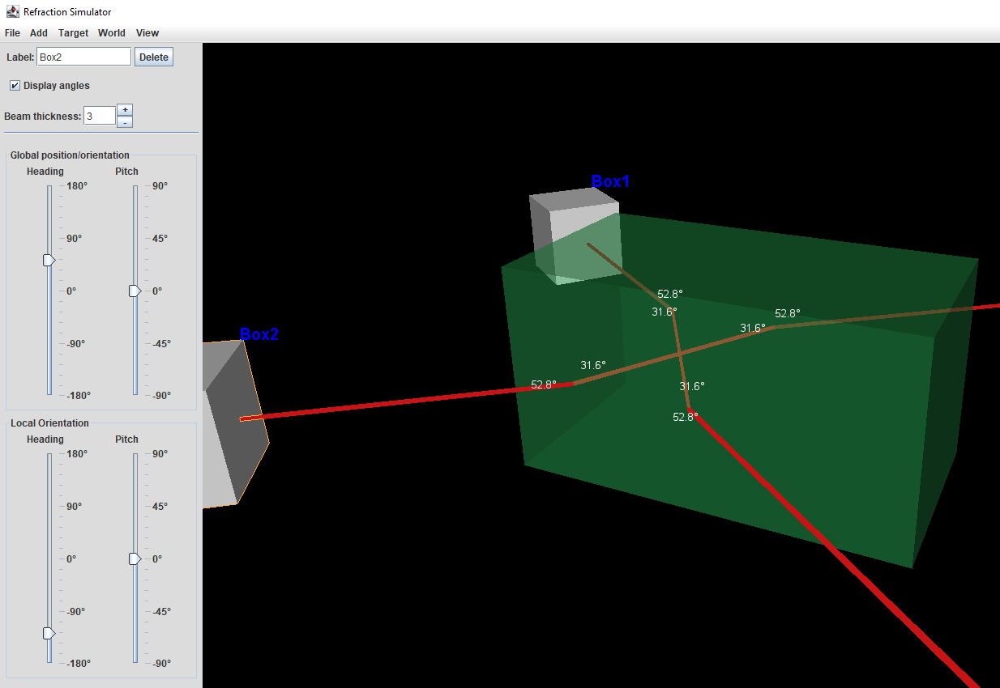
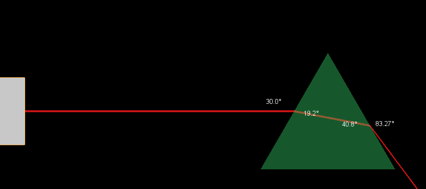

# Refraction Simulator

This application provides a real-time 3-D environment for demonstrating refraction and total internal reflection.
It can be used in classroom demonstrations and potentially for setting Physics questions involving Snell&rsquo;s law.
It&rsquo;s also just fun to play with.

## How it works

You create ray boxes that shine beams of light through a transparent object.
You can move and rotate these ray boxes around in 3-D space to make the beams hit different parts of the object at different angles.



You can also change the shape and material (i.e. the refractive index) of the transparent object, or even change the material of the surroundings.
For example, you could observe the amount of refraction when shining a beam through a prism underwater versus in air.

If you need the simplicity of two dimensions then you can turn off perspective mode and view from the side or directly above.



## Getting Started

Running the program is as simple as downloading the RefractionSimulator.jar file and running it with Java 7 or newer. If you&rsquo;re lucky, that just means double-clicking the JAR file.
If that doesn&rsquo;t work you can try running the Run.bat file.
From the commandline you can run the program with this command:
```
java -jar RefractionSimulator.jar
```
If you are still having problems, make sure you have Java installed and that your PATH and JAVA_HOME environment variables are set correctly to use Java.

### Using the program
The program is simple to get the hang of with just a bit of playing around. Left-click and drag to move around. Scroll or right-click and drag to zoom in or out.

If you want more detailed instructions you can read the [user manual](documents/User%20Manual.pdf).

## Background

This application was created as an A-level Computing project in 2015.
In the interest of receiving more credit and learning about 3-D manipulation and rendering, I decided to implement the graphics from scratch.
One could no doubt improve performance and get flashier graphics by using popular 3-D libraries, but I think doing it myself was more interesting and rewarding.
So perhaps other people can also learn a bit about 3-D graphics from looking at this project and extending it.

The [PDF documents](documents) go into detail about the original purpose of this project, its design, manual testing, and appraisal.

The source code has not been altered since 2015 but has now been released on GitHub in 2020.

## License

I have chosen to license this project under the [MIT license](LICENSE.txt) to give the most freedom for people to modify and redistribute this software.